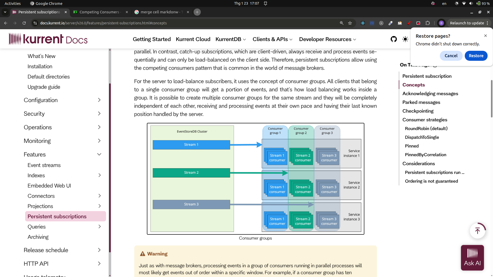

# Kurrent DB Flow

## Knowledge

1. Persistent subscription

Server remember state!

- Run on single node (Leader node)
- Suitable to handle distribute messages to many workers (If only one consumer -> consume without race condition)

|                            | Persistent                                     | Catch up                      | Volatile |
| -------------------------- | ---------------------------------------------- | ----------------------------- | -------- |
| Same                       | Deliver event to connected subscriber          |                               |          |
|                            | Maintained by server                           | -                             | -        |
| Last known position keeper | Server side (enable subscriber load balancing) | Subscriber side (client side) |          |
| persistent order           |                                                | Yes                           |          |

- Advantages of the server can have information of the last position
  Each service aka client does not need to know each other, can send and receive events independently.

Explain: each stream can have multiple consumer ~~ client ~~ services to subscribe.
Each service receive a portion of events from each stream by belong to a specific CONSUMER GROUP

- What if message failed too many times

  It will be placed in $persistentsubscription-{streamname}::{groupname}-parked stream

  There is a handler to handle replay failed message

### Example usage

#### ❌ Không có persistent subscription

Consumer crash → mất event

Không retry

Không biết đã xử lý tới đâu

#### ❌ Chỉ có persistent subscription (1 consumer)

An toàn

Nhưng chậm, không scale

#### ✅ Persistent subscription + competing consumer

Order stream 1M events

5 consumers xử lý song song

Consumer #3 chết → event được trả lại queue

Không mất gì cả

## Implementation

### Answer the following questions first

1. How to track user logging event from Keycloak

a. DIY: track by adding a service for stream update, use it along the way of sign up/login/logout flow with keycloak (side effect)

b. Keycloak can emit event, therefore send the keycloak event to BE server

-> Need a BE service to handle the task, it should be the Publisher in the flow

Create a Pub-Sub flow as follow

1. A persistent subscription stream on kurrentDB, name My_Stream_Diy, group name My_Group_Diy

in the stream will have a list of event of user logging in | logging out

2. Publisher is placed in spring-project/demo, interact with keycloak

3. A loan subscriber need to receive value from the stream, ack of the users sign up/login/logout state, placed inside spring-project.

4. A credit approval subscriber need to receive value from the stream, ack of the users sign up/login/logout state, each user have his own personal information and his credit score, need to have example logic approval to handle each user with credit score, placed inside spring-project.

## Loan + Credit approval implementation (spring-project/demo)

- Stream + group: My_Stream_Diy with persistent subscription group My_Group_Diy auto-created on startup.
- Publisher: POST /kurrentdb/auth-events with JSON payload
  {
  "userId": "e9b3",
  "username": "alice",
  "email": "alice@example.com",
  "fullName": "Alice Doe",
  "country": "US",
  "creditScore": 720,
  "annualIncome": 90000,
  "eventType": "LOGIN",
  "occurredAt": 1737854050123
  }
  The service appends the event to stream My_Stream_Diy with event type KeycloakAuthEvent-<EVENTTYPE>.
- Subscribers: UserAuthPersistentSubscription attaches to My_Stream_Diy/My_Group_Diy and fan-out each event to LoanTrackingService (keeps last login/logout/signup status) and CreditApprovalService (derives credit decision and max loan).
- Query endpoints: GET /loan/statuses, /loan/statuses/{userId}, /loan/credit-decisions, /loan/credit-decisions/{userId} to inspect in-memory loan/credit snapshots.
- Notes: credit score can be provided in the event; if missing, a deterministic fallback is derived from user id so the credit approval logic always runs.
